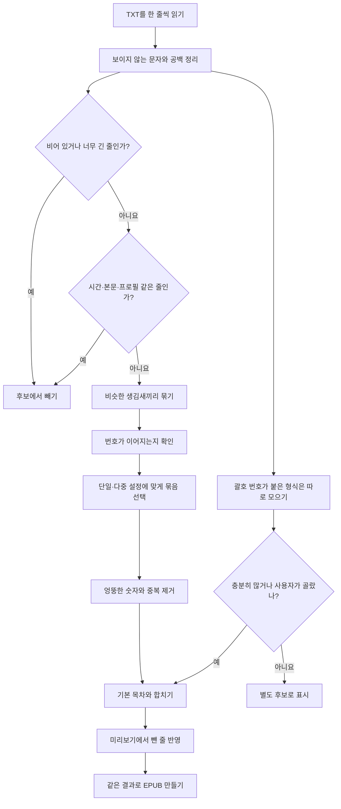

# 제목 파서 정리

제목 파서는 글을 한 줄씩 읽으면서 "이 줄이 새 장의 시작인가?"를 판단한다. 제목처럼 생겼다는 이유만으로 바로 목차에 넣지는 않는다. 비슷한 줄이 반복되는지, 번호가 제대로 이어지는지, 평범한 본문은 아닌지까지 확인한다.

처음 읽는다면 아래 요약과 순서도만 보면 된다. 실제 규칙을 고칠 때는 그다음의 자세한 기준과 마지막 코드 표를 함께 본다.

## 1분 요약

- 우선 `1화`, `Chapter 2`, `< 003. 제목 >`처럼 제목일 만한 줄을 모은다.
- 시간 표시, 대화문, 프로필 정보, `끝` 표식처럼 제목이 아닌 줄은 뺀다.
- 남은 줄을 생김새가 비슷한 것끼리 묶는다. 이 묶음을 코드에서는 `그룹`이라고 부른다.
- 각 그룹의 번호가 `1, 2, 3`처럼 이어지는지 확인한다. 중간에 엉뚱한 숫자가 끼면 제외한다.
- 단일 패턴에서는 가장 그럴듯한 그룹 하나를 고르고, 다중 패턴에서는 검사를 통과한 여러 그룹을 함께 쓴다.
- `(1)`, `(2)`가 붙은 다른 형식은 따로 보여주며, 충분히 많으면 주 목차로 올린다.
- 마지막 선택은 미리보기에서 사용자가 직접 빼거나 되살릴 수 있다.

이 문서에서 `후보`는 아직 확정되지 않은 줄, `그룹`은 생김새가 같은 후보 묶음, `주 목차`는 실제 EPUB에 사용할 제목 목록을 뜻한다. `오탐`은 본문을 제목으로 잘못 잡은 경우다.

## 전체 순서



## 자세한 기준: 제목 후보 만들기

### 줄 정리

`cleanLine()`에서 HTML 공백 문자와 제로 폭 문자, BOM을 없애고 줄 앞뒤를 정리한다. 빈 줄과 90자를 넘는 줄은 기본 제목 후보에서 빠진다.

일반 후보는 위아래가 빈 줄이어야 한다. 다만 시작부터 제목 형식이 뚜렷한 줄은 이 조건을 적용하지 않는다.

- `제1화`, `Chapter 1`, `#1`로 시작하는 줄
- `< 007. 제목 >`, `< 독방 - [3] >`처럼 감싼 줄
- `프롤로그`, `후기` 같은 특수 제목
- 숫자만 적힌 줄

### 내장 그룹

파서는 생김새가 비슷한 제목을 같은 상자에 담는다. 코드에서는 이 상자를 `그룹`이라고 부른다. 한 줄이 여러 상자에 들어갈 수 있을 때는 아래에서 먼저 나온 상자를 쓴다.

| 코드 안 이름 | 쉽게 말하면 | 예시 |
| --- | --- | --- |
| `KOR_*` | 번호 뒤에 `화`, `장`, `수` 같은 한국어 단위가 붙음 | `12화 출발`, `3장 재회` |
| `KOR_SUFFIX_*` | 한국어 번호 단위가 제목 뒤쪽에 있음 | `스트라이커 45화` |
| `ENG_*` | 영어 회차 이름으로 시작함 | `Chapter 2`, `EP.3` |
| `SPECIAL` | 번호가 없어도 제목으로 쓰는 말 | `프롤로그`, `외전`, `후기` |
| `BRACKET_SUFFIX` | 꺾쇠 안에 제목과 별도 번호가 있음 | `< 독방 - [3] >`, `< 007. 제목 >` |
| `BRACKET` | 괄호나 꺾쇠로 감싼 짧은 제목 | `<제1화 시작>` |
| `SHARP` | `#` 뒤에 번호가 붙음 | `#1. 시작` |
| `NUMBER` | 숫자 자체가 제목 표식으로 쓰임 | `1. 시작`, `001`, `[3]` |
| `AUTO_*` | 위 형식에는 없지만 파일에서 같은 모양이 반복됨 | `Story@001`, `Story@002` |

한국어와 영문 그룹은 단위별로 나뉜다. 예를 들어 `KOR_화`와 `KOR_장`, `ENG_CHAPTER`와 `ENG_EP`는 서로 다른 그룹이다.

### 정규식은 무엇인가

정규식은 "이런 모양의 글자를 찾아라"라고 적어 둔 검색 규칙이다. 예를 들어 아래 규칙은 줄 맨 앞에서 `제1화`, `12화` 같은 모양을 찾는다.

```regex
/^제?\s*\d+화/
```

이 규칙은 `제 12화 시작`과 `12화 시작`에는 맞지만, `오늘 12화를 읽었다`에는 맞지 않는다. `^`가 "줄 맨 앞"을 뜻하기 때문이다.

자주 나오는 기호만 알아도 대부분의 패턴을 읽을 수 있다.

| 기호 | 뜻 | 예시 |
| --- | --- | --- |
| `^` | 줄의 시작 | `^제`는 줄 맨 앞의 `제`만 찾음 |
| `$` | 줄의 끝 | `끝$`는 마지막에 있는 `끝`만 찾음 |
| `\d` | 숫자 한 자리 | `\d+`는 `1`, `12`, `300`을 찾음 |
| `\s*` | 공백이 없거나 여러 개 | `제  1화`처럼 공백이 달라도 허용 |
| `[화회장]` | 괄호 안 문자 중 하나 | `1화`, `1회`, `1장` |
| `(...)` | 여러 규칙을 한 묶음으로 처리 | 번호와 단위를 같이 묶을 때 사용 |
| `?` | 바로 앞 항목이 없어도 됨 | `제?`는 `제1화`와 `1화` 모두 허용 |
| `+` | 바로 앞 항목이 한 번 이상 반복 | `\d+`는 여러 자리 숫자도 허용 |
| `|` | 둘 중 하나 | `화|장`은 `화` 또는 `장` |
| `(?!...)` | 뒤에 특정 내용이 오면 제외 | `1화 때` 같은 본문을 막을 때 사용 |
| `(?<!...)` | 앞에 특정 내용이 있으면 제외 | 문장형 종결을 막을 때 사용 |
| `i` | 영문 대소문자를 구분하지 않음 | `ep`, `EP`, `Ep`를 같이 허용 |

실제 정규식은 Web Worker를 만드는 문자열 안에 있어서 코드에는 `\\d`, `\\s`처럼 역슬래시가 두 번 적혀 있다. Worker가 실행할 때는 각각 `\d`, `\s` 한 번으로 바뀐다.

### 감싼 제목 정규식

괄호나 꺾쇠로 감싼 제목은 한 규칙에 모두 넣지 않고 세 갈래로 나눴다. 각 형식의 번호 위치가 다르기 때문이다.

| 코드 안 이름 | 읽는 방법 | 맞는 예 |
| --- | --- | --- |
| `BRACKET_TITLE_PATTERN` | 괄호 안쪽이 회차 번호나 특수 제목으로 시작함 | `<제1화 제목>`, `[Chapter 2]`, `<프롤로그>` |
| `BRACKET_SUFFIX_TITLE_PATTERN` | 제목 뒤에 `- [번호]`가 붙음 | `< 소환전 - [1] >`, `# 대학 - [서장] #` |
| `WRAPPED_NUMBER_TITLE_PATTERN` | 괄호 안쪽이 `숫자.` 또는 `숫자)`로 시작함 | `< 006. 들린다 >`, `< 017. 제목 >` |

뒤의 두 형식은 제목 표식이 분명하다고 보고 단일 패턴에서도 기본으로 살린다.

### 커스텀 정규식

고급 설정의 긴 정규식은 여러 규칙을 `|`로 이어 붙인 것이다. 왼쪽부터 차례로 다음 모양을 찾는다.

1. `<제1화 제목>`처럼 감싼 제목
2. `제1화`, `2회`, `3수`로 시작하는 한국어 제목
3. `Chapter 1`, `Episode 2`, `Part 3` 같은 영문 제목
4. `#1`, `＃2`로 시작하는 제목
5. 숫자로 시작하는 일반 제목

마지막 규칙은 가장 넓게 잡기 때문에 제외 조건도 같이 들어 있다. `2026년`, `10분`, `3층`, `5위`, `100원`처럼 본문에서 자주 쓰는 숫자는 받지 않는다. `말했다.`, `가자.`, `좋아요.`처럼 문장으로 끝나는 줄도 피한다.

이 정규식은 전체 파서를 대신하지 않는다. 여기서 일치해도 본문 제외 검사와 번호 흐름 검사를 다시 거쳐야 목차가 된다.

사용자가 기본 정규식을 수정하면 일치한 줄을 `CUSTOM`으로 먼저 분류한다. `CUSTOM` 항목이 하나라도 있으면 이 그룹을 주 목차로 쓴다. 일치한 항목이 없으면 내장 그룹 선택으로 돌아간다.

커스텀 정규식도 다음 조건은 건너뛸 수 없다.

- 90자 길이 제한
- 공통 본문 제외 규칙
- 약한 후보의 위아래 빈 줄 조건

## 본문으로 보고 빼는 경우

`shouldSkipCandidate()`는 모든 그룹이 함께 쓰는 제외 규칙이다. 새 오탐이 특정 제목 형식에만 묶이지 않는다면 이곳에서 막는 편이 안전하다.

| 제외 대상 | 예시 또는 판단 근거 |
| --- | --- |
| 작가 표식 | `작가의 말`은 제외하고 `후기`는 남긴다. |
| 종료 표식 | `끝`으로 끝나는 줄은 이전 회차의 끝으로 본다. |
| 타임코드 | `[00:00:01]`, `00:00:03,500 --> 00:00:05,000` |
| 프로필 행 | `배우자 \| 이름(1904)` 같은 위키형 정보 |
| 잘못 감싼 문장 | 괄호는 있지만 허용된 감싼 제목 형식이 아닌 줄 |
| 일반 인용문 | 따옴표로 시작하는 대사나 인용문 |
| 회차를 언급한 본문 | `3화 때`, `2장으로`, `곧바로 3화.` |
| 긴 문장형 줄 | 문장 종결 표현이 있고 제목으로 보기에는 긴 줄 |
| 수치 표현 | 날짜, 시간, 금액, 단위, 순위, 층수 등 |

코드에서는 이 기준도 작은 정규식으로 나눠 둔다.

| 코드 안 이름 | 쉽게 말하면 | 걸러내는 예 |
| --- | --- | --- |
| `sentenceSuffixPattern` | 끝맺는 말투를 보고 일반 문장인지 확인 | `움직이더라.`, `그렇게 생각한다.` |
| `chapterSuffixPattern` | `화`, `장`, `수` 뒤에 조사가 이어지는지 확인 | `3화 때`, `2장으로`, `5수 정도` |
| `chapterReferenceSentencePattern` | 문장 안에서 회차를 언급하고 마침표로 끝나는지 확인 | `곧바로 3화.` |
| `timecodePattern` | 시, 분, 초가 콜론으로 이어지는지 확인 | `[00:00:01]` |
| `profileRowPattern` | 이름·관계 정보 뒤에 연도가 붙는지 확인 | `배우자 | 이름(1904)` |
| `bannedRegex` | 숫자 뒤에 날짜·금액·단위가 붙는지 확인 | `2026년`, `100원`, `3층` |

먼저 `끝`, 타임코드, 프로필처럼 확실한 잡음을 뺀다. 그다음 문장 말투와 숫자 단위를 보는 넓은 필터를 적용한다. 넓은 필터부터 쓰면 정상 제목까지 지울 수 있기 때문에 순서를 나눴다.

강한 제목 형식은 문장 길이 조건을 조금 느슨하게 적용한다. 그렇더라도 `끝`, 타임코드, 프로필 행은 무조건 제외한다.

대표적인 오탐 사례는 다음과 같다.

```text
[00:00:01]
곧바로 3화.
5화 때 시청률이 올랐다.
아, 그…… <민중을 이끄는 자유의 여신(1830)> 말인가.
배우자 | 로웨나 진-로스차일드(1904)
< 80화 반시 (1) > 끝
```

## 번호 흐름을 확인하는 방법

### 대표 번호

`getChapterNum()`은 한국어 단위 번호, 영문 번호, 해시 번호, 일반 숫자 순으로 대표 번호를 찾는다. 한 줄에 숫자가 여러 개 있으면 그룹 전체를 비교해 가장 긴 흐름을 만드는 숫자 열을 고른다. 제목마다 연도와 화수가 같이 있어도 화수 쪽 흐름을 선택하기 위한 처리다.

### 연속 번호

기본 기준은 `이전 번호 + 1`이다.

- 처음에는 이어지는 번호가 두 개 이상 있어야 한다.
- 중복되거나 뒤로 가는 번호는 건너뛴다.
- 기대한 번호가 뒤에 다시 나오면 중간에 끼어든 숫자는 버린다.
- 흐름이 잡힌 뒤 일부 회차가 빠졌다면 10 이하의 단독 간격은 같은 패턴으로 본다.
- 간격 뒤에 연속 번호가 두 개 이상 다시 나오면 후속 구간으로 이어 붙인다.

그래서 `3, 4, 7`은 같은 형식의 누락 회차로 이어질 수 있다. 반면 `3, 7, 8, 9, 4`에서는 먼저 잡힌 흐름과 무관하게 끼어든 숫자를 주 흐름으로 쓰지 않는다.

서로 다른 그룹도 번호가 정확히 이어지면 합칠 수 있다. 단일 패턴에서는 `＃109화`, `＃110화`, `111화`처럼 표식이 바뀌어도 하나의 임시 그룹으로 묶는다.

### 같은 회차의 부 번호

`107장 특전대 (1)`, `107장 특전대 (2)`처럼 본 제목 번호는 같고 뒤의 부 번호만 늘어나는 형식도 별도로 확인한다. 같은 제목 바탕에서 부 번호가 이어지면 둘 다 남긴다.

### 처음 보는 형식

`discoverSequentialTitleGroups()`는 50자 이하의 줄에서 숫자 앞뒤에 반복되는 단어와 기호를 찾는다. 같은 모양의 숫자가 이어지면 `AUTO_*` 그룹을 만든다.

예를 들어 `Story@001 :: Alpha`, `Story@002 :: Beta`는 `Story@{n}::`에 가까운 공통 모양으로 묶인다. 이미 신뢰할 만한 내장 제목 흐름이 있으면 새 자동 그룹을 억지로 더하지 않는다. 괄호 번호형은 이 단계가 아니라 뒤의 다른 형식 후보 단계에서 처리한다.

## 주 목차를 고르는 순서

### 단일 패턴

`SPECIAL`과 `BRACKET_SUFFIX`는 기본으로 유지한다. 나머지 그룹에서는 하나를 고른다.

파일명에 화수 범위가 없으면 제목 수가 많은 그룹을 먼저 본다. 개수가 같으면 파일에서 먼저 나온 그룹을 고르고, 시작 위치까지 같을 때만 그룹 신뢰도를 비교한다.

```text
KOR, ENG > BRACKET, BRACKET_SUFFIX, SHARP > NUMBER > AUTO/CUSTOM 기타 그룹
```

파일명에 `1-200`, `1~200`, `1–200` 같은 범위가 있으면 마지막 범위를 참고한다. 파일명 범위와 많이 겹치는 그룹, 시작과 끝이 더 가까운 그룹, 제목 수가 많은 그룹 순으로 고른다. 따라서 `1화`, `2화`, `3화`가 있다는 이유만으로 그 형식이 주 목차가 되지는 않는다.

### 다중 패턴

다중 패턴에서는 오탐 필터와 숫자 흐름 검사를 통과한 그룹을 함께 쓴다. 정규식에 걸린 줄을 전부 넣는 방식은 아니다.

같은 번호가 다른 그룹에 있으면 다중 패턴에서는 각각 남긴다. 단일 패턴에서는 대표 번호와 부 번호가 같은 항목을 하나로 줄인다.

### 마지막 정리

연속 번호가 확인된 제목과 강한 제목 그룹은 기준점이 된다. 약한 숫자 후보는 앞뒤 기준점의 번호 범위에 들어올 때만 남는다. 강한 제목 사이에 전혀 관계없는 낮은 우선순위 숫자 흐름이 끼면 이 단계에서 제거한다.

중복은 단일 패턴에서는 `대표 번호 + 부 번호`, 다중 패턴에서는 `그룹 + 대표 번호 + 부 번호`로 판단한다. `BRACKET_SUFFIX`는 제목 전체가 같을 때만 중복으로 본다.

## 다른 형식의 목차 후보

제목 끝이나 중간에 `(1)`, `（2）` 같은 번호가 붙은 줄은 기본 그룹과 따로 모은다.

```text
내집 마련의 꿈(2)
콘티가 움직이더라 (1)
비료를 거름삼아 (1)
' 이 프로그램은 보고 계신 스폰서의 제공으로 보내드립니다(3)(무료 마지막화입니다!) '
```

`findParenthesizedTitleFallback()`은 70자 이하이면서 괄호 번호 앞에 한글, 영문, 한자, 일본어가 있는 줄을 찾는다. 프로필 행과 `끝` 표식은 제외하고, 번호 뒤에는 짧은 부제나 괄호형 안내 문구만 허용한다. 공통 필터에서 문장으로 빠진 긴 후보는 감싼 형식이거나 같은 제목 바탕이 반복될 때만 다시 살린다.

이 후보는 단일·다중 설정과 상관없이 미리보기에 나온다. 사용자가 추가하면 미리보기뿐 아니라 실제 EPUB 목차에도 반영된다.

후보가 기존 결과보다 확실히 많으면 자동으로 주 목차로 올린다.

- 기존 감지 결과가 2개 이상이어야 비교한다.
- 후보 수가 기존 결과의 2배 이상이어야 한다.
- 동시에 기존 결과보다 3개 이상 많아야 한다.
- 단일 패턴에서는 기존 일반 그룹을 바꾸되 `SPECIAL`은 남긴다.
- 다중 패턴에서는 기존 결과에 후보를 더한다.
- 커스텀 정규식을 수정한 상태에서는 자동으로 올리지 않는다.

일반 후보와 감싼 후보는 따로 센다. 후보 하나가 기본 파서에도 잡혔다면 같은 제목 바탕을 가진 앞뒤 후보를 함께 목차로 올린다.

## 미리보기와 실제 변환

최종 적용 순서는 짧다.

1. 자동 감지 결과를 만든다.
2. 자동 승격 항목과 사용자가 추가한 다른 형식 후보를 넣는다.
3. 사용자가 `X`로 제외한 줄을 뺀다.
4. 같은 결과로 미리보기, 유효성 검사, EPUB 챕터 분할을 처리한다.

원본 TXT는 건드리지 않는다. 후보 추가와 제외 상태는 현재 페이지에 올려 둔 파일에만 유지된다.

## 규칙을 손볼 때

실제 파서 코드는 `index.html`의 Web Worker 안에 있고, 회귀 테스트는 `tests/smoke.test.mjs`에 있다.

| 코드 | 맡은 일 |
| --- | --- |
| `strongStartPatterns` | 위아래 빈 줄 없이도 볼 강한 제목 시작 |
| `shouldSkipCandidate()` | 모든 형식에 공통으로 적용할 오탐 제외 |
| `groupMatchers` | 알려진 제목 형식 분류 |
| `getTitleSequenceIndexes()` | 같은 그룹의 번호 흐름 확인 |
| `discoverSequentialTitleGroups()` | 정규식에 없는 반복 형식 탐색 |
| `buildActiveGroups()` | 단일·다중 패턴의 주 그룹 선택 |
| `findParenthesizedTitleFallback()` | 괄호 번호형 후보 찾기 |
| `applySelectedTitleFallback()` | 후보 승격과 사용자 선택 반영 |

새 사례가 생기면 먼저 `tests/smoke.test.mjs`에 잡혀야 할 줄과 비슷한 오탐 줄을 함께 넣는다. 기존 그룹으로 설명할 수 있으면 정규식 하나만 좁게 고친다. 여러 형식에서 생기는 오탐은 `shouldSkipCandidate()`에서 막고, 새 그룹은 기존 그룹으로 설명할 수 없을 때만 만든다.

괄호 번호형은 기본 그룹을 늘리기 전에 다른 형식 후보로 처리할 수 있는지 먼저 본다. 수정 뒤에는 단일·다중 패턴을 모두 검사하고 README와 기능 소개도 실제 동작에 맞춘다.

```powershell
node --test tests/smoke.test.mjs
```

이 파서는 자연어 모델이 아니라 규칙과 반복 횟수로 판단한다. 한 번만 나오는 낯선 제목이나 본문과 모양이 거의 같은 제목은 놓칠 수 있다. 이런 경우 임계값부터 넓히면 오탐이 더 늘기 쉽다. 새 샘플과 가장 비슷한 오탐을 테스트에 같이 남긴 뒤 필요한 부분만 고친다.
